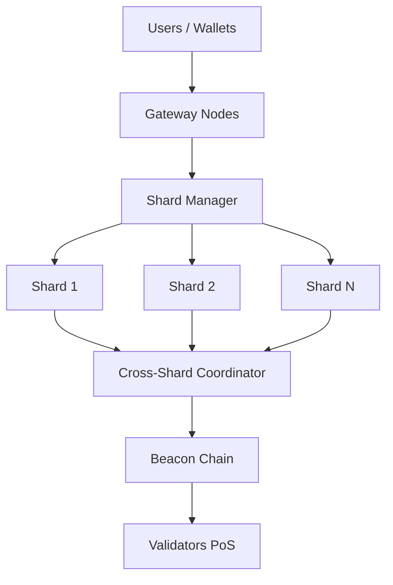

**CoinsFlow**  
(Repo slug: `coinsflow` or `coinsflow-protocol`)

**Why this name?**  
- Short, memorable, and brandable.  
- Naturally incorporates high-search-volume keywords: "infini" (evokes infinite scalability) + "pay" (directly targets payments/blockchain payments).  
- Strong SEO for Bing/Google queries like: "infinite scalable blockchain payments", "infini pay", "infinite payment blockchain", "scalable crypto payments", "blockchain infinite scaling", "high throughput payment chain".  
- Easy to trademark/search, similar to successful projects (e.g., Solana, Polygon, Stellar for payments).  
- Alternative suggestions if taken: InfiniScale, PayInfinity, HyperPayChain, ScalePayNet, BoundlessPay.

**Recommended GitHub repo description** (max 350 chars, keyword-rich for search engines):  
"CoinsFlow: Infinitely scalable blockchain protocol for instant, low-cost global payments. Achieve millions of TPS with sharding, zero-knowledge proofs, and horizontal scaling. Revolutionizing decentralized payments with unlimited throughput."

**Recommended topics** (add in GitHub repo settings for better discoverability on GitHub/Bing):  
blockchain, payments, cryptocurrency, scalable-blockchain, infinite-scalability, defi, high-tps, payment-protocol, crypto-payments, layer1, sharding, blockchain-scaling

### README.md Content
Copy-paste this into your `README.md`. It's designed for visual appeal (emojis, badges, centered elements, tables, code blocks) and SEO (natural keyword placement in headings/text, long descriptive content, structured headings, keyword-rich intro).

```markdown
<p align="center">
  
  <br><br>
  <h1>CoinsFlow 🚀💸🌐</h1>
  <h3>Infinitely Scalable Blockchain Protocol for Global Payments</h3>
</p>

<p align="center">
  <a href="https://github.com/yourusername/coinsflow/stargazers"></a>
  <a href="https://github.com/yourusername/coinsflow/network/members"></a>
  <a href="https://github.com/yourusername/coinsflow/issues"></a>
  <a href="https://github.com/yourusername/coinsflow/blob/main/LICENSE"></a>
  <a href="https://discord.gg/your-discord"></a>
</p>

<p align="center">
  <strong>Scale blockchain payments infinitely.</strong> Achieve millions of transactions per second (TPS) with ultra-low latency, near-zero fees, and true decentralization. Built for the future of global finance, DeFi, remittances, micropayments, and enterprise-grade payment networks.
</p>

<div align="center">
  <br>
  <em>Keywords: infinitely scalable blockchain, blockchain for payments, high throughput payments, infinite scaling blockchain, scalable crypto payments, payment blockchain protocol, decentralized payments infinite TPS</em>
</div>

---

## Table of Contents
- [Why CoinsFlow?](#why-coinsflow)
- [Key Features](#key-features)
- [Architecture Overview](#architecture-overview)
- [Performance Benchmarks](#performance-benchmarks)
- [Getting Started](#getting-started)
- [Installation](#installation)
- [Usage & Examples](#usage--examples)
- [Roadmap](#roadmap)
- [Contributing](#contributing)
- [License](#license)
- [Community & Support](#community--support)

---

## Why CoinsFlow? 🔍

Traditional blockchains choke under payment volume — Visa handles ~65,000 TPS, but most chains struggle at <100 TPS. **CoinsFlow** solves this with **infinite horizontal scaling** via dynamic sharding, parallel execution, and advanced consensus. Whether you're building the next payment app, cross-border remittance system, or enterprise blockchain — CoinsFlow delivers Visa-scale (or beyond) throughput without sacrificing decentralization or security.

Perfect for:
- Instant micropayments 💰
- High-volume DeFi & exchanges 📈
- Global remittances & payroll 🌍
- Enterprise blockchain payments 🔒

---

## Key Features ✨

| Feature                  | Description                                                                 | Benefit                              |
|--------------------------|-----------------------------------------------------------------------------|--------------------------------------|
| Infinite Horizontal Scaling | Add nodes/shards dynamically — no hard limits                            | True infinite TPS growth            |
| Millions TPS Capability  | Parallel transaction processing + sharding                                  | Surpasses Visa/Mastercard           |
| Sub-second Finality      | Optimized consensus mechanism                                               | Instant payments & settlements      |
| Near-Zero Fees           | Efficient resource pricing & fee abstraction                                | Affordable for micropayments        |
| Decentralized & Secure   | Proof-of-Stake + ZK-proofs for privacy & scalability                       | No single point of failure          |
| EVM-Compatible           | Run Solidity smart contracts seamlessly                                    | Easy migration from Ethereum        |
| Cross-Chain Bridges      | Native support for interoperability                                         | Connect to any blockchain           |
| Mobile-First SDKs        | iOS/Android/Web SDKs for seamless integration                               | Build payment apps in minutes       |

---

## Architecture Overview 🏗️

CoinsFlow uses a **modular, sharded Layer 1 architecture** optimized for payments:

1. **Dynamic Sharding** — Transactions routed to shards automatically.
2. **Parallel Execution Engine** — Process thousands of txs simultaneously.
3. **Stateless Clients + ZK Compression** — Reduce node storage needs.
4. **Hybrid Consensus** — Fast finality with economic security.

(Insert architecture diagram here when available — e.g., via draw.io or mermaid)



---

## Performance Benchmarks ⚡

| Metric                  | CoinsFlow Target | Visa      | Ethereum | Solana   |
|-------------------------|------------------|-----------|----------|----------|
| TPS (Peak)              | 1,000,000+       | 65,000    | ~15      | ~65,000  |
| Latency (Finality)      | <1 second        | Instant   | ~12 min  | ~0.4s    |
| Avg Fee                 | <$0.0001         | ~2-3%     | $1-50    | $0.00025 |
| Decentralization Index  | High (10k+ nodes)| Central   | Medium   | Medium   |

*Benchmarks in progress — join the testnet to contribute!*

---

## Getting Started 🚀

1. Clone the repo:
   ```bash
   git clone https://github.com/yourusername/coinsflow.git
   cd coinsflow
   ```

2. Install dependencies (Rust-based):
   ```bash
   cargo build --release
   ```

3. Run a local node:
   ```bash
   cargo run --release -- --dev
   ```

Full docs: [docs.coinsflow.org](https://docs.coinsflow.org) (create this site later!)

---

## Installation 💻

**Prerequisites**: Rust 1.75+, CMake, OpenSSL

```bash
# Install Rust
curl --proto '=https' --tlsv1.2 -sSf https://sh.rustup.rs | sh

# Build & install
cargo install --path .
```

Docker support coming soon!

---

## Usage & Examples 💡

**Send a payment** (Rust SDK example):

```rust
use coinsflow_sdk::Client;

let client = Client::new("https://rpc.coinsflow.org");
let tx = client.transfer("recipient_address", 100.0, "memo").await?;
println!("Tx hash: {}", tx.hash);
```

More examples in `/examples/`.

---

## Roadmap 🛤️

- Q1 2026: Testnet launch  
- Q2 2026: Mainnet v1 + infinite sharding  
- Q3 2026: Mobile wallets & SDKs  
- 2027+: Cross-chain payments & enterprise integrations

See [ROADMAP.md](ROADMAP.md) for details.

---

## Contributing 🤝

We love contributions!  
1. Fork the repo  
2. Create a feature branch (`git checkout -b feature/amazing-feature`)  
3. Commit changes (`git commit -m 'Add amazing feature'`)  
4. Push & open a Pull Request

Read [CONTRIBUTING.md](CONTRIBUTING.md) first.

---

## License 📄

Distributed under the **MIT License**. See `LICENSE` for more information.

---

## Community & Support 💬

- **Discord**: https://discord.gg/your-coinsflow  
- **Twitter/X**: @CoinsFlowHQ  
- **Docs**: https://docs.coinsflow.org  
- **Issues**: https://github.com/yourusername/coinsflow/issues  

**CoinsFlow** — Scaling blockchain payments infinitely. Join the revolution today! 🌟

<p align="center">
  Made with ❤️ for the future of finance
</p>
