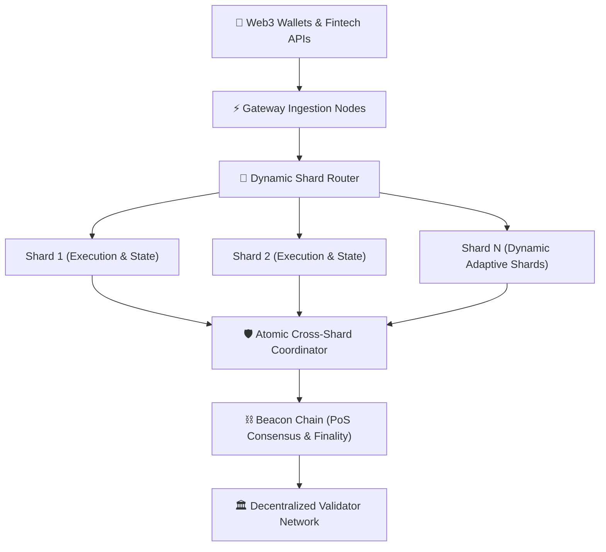

<p align="center">
  
  <br><br>
  <h1 align="center">CoinsFlow 🚀💸🌐</h1>
  <h3 align="center">Infinitely Scalable Layer-1 Blockchain Protocol for Global Payments, High-Throughput DeFi & Instant Web3 Settlements</h3>
</p>

<p align="center">
  <a href="https://github.com/ishandutta2007/CoinsFlow/stargazers"></a>
  <a href="https://github.com/ishandutta2007/CoinsFlow/network/members"></a>
  <a href="https://github.com/ishandutta2007/CoinsFlow/issues"></a>
  <a href="https://github.com/ishandutta2007/CoinsFlow/blob/main/LICENSE"></a>
  <a href="https://discord.com/invite/jc4xtF58Ve"></a>
</p>

<p align="center">
  <strong>Scale blockchain payments infinitely.</strong> Deliver 1,000,000+ transactions per second (TPS) with sub-second finality, near-zero transaction fees (&lt;$0.0001), EVM compatibility, and enterprise-grade security. Designed for global financial institutions, fintech APIs, DeFi orderbooks, merchant checkouts, and decentralized micropayments.
</p>

<div align="center">
  <sub><strong>Core Focus:</strong> High-Throughput Payments • Dynamic State Sharding • Parallel Execution • Zero-Knowledge Compression • Low-Latency Consensus</sub>
</div>

---

## 📑 Table of Contents
- [Overview & Value Proposition](#-overview--value-proposition)
- [Why CoinsFlow?](#-why-coinsflow)
- [Key Features & Technical Advantages](#-key-features--technical-advantages)
- [Architecture & Protocol Design](#-architecture--protocol-design)
- [Performance & Benchmark Comparison](#-performance--benchmark-comparison)
- [Real-World Use Cases](#-real-world-use-cases)
- [Developer Quickstart](#-developer-quickstart)
  - [Prerequisites](#prerequisites)
  - [Building from Source](#building-from-source)
  - [Running a Local Dev Node](#running-a-local-dev-node)
  - [SDK Integration Examples](#sdk-integration-examples)
- [Frequently Asked Questions (FAQ)](#-frequently-asked-questions-faq)
- [Roadmap](#-roadmap)
- [Contributing](#-contributing)
- [License](#-license)
- [Community & Ecosystem](#-community--ecosystem)

---

## 🌐 Overview & Value Proposition

Traditional layer-1 blockchains suffer from trilemma bottlenecks, high network congestion, fluctuating gas fees, and high confirmation latency — making them impractical for point-of-sale systems, global remittances, high-frequency trading, and consumer fintech applications.

**CoinsFlow** is a next-generation **Layer-1 blockchain architecture** designed from the ground up for **infinite horizontal scaling** and **high-throughput financial transactions**. By combining **dynamic adaptive sharding**, a **lock-free parallel execution engine**, **zero-knowledge (ZK) state compression**, and a lightweight **hybrid Proof-of-Stake (PoS) consensus**, CoinsFlow achieves the throughput and latency required to power real-world commerce at the scale of Visa, Mastercard, and global automated clearing houses (ACH).

---

## ⚡ Why CoinsFlow?

| Legacy Blockchains & Payment Rails | The CoinsFlow Advantage |
|:---|:---|
| **Low Throughput:** Ethereum (~15 TPS), Bitcoin (~7 TPS) fail under peak loads. | **Infinite Throughput (1M+ TPS):** Adaptive multi-sharding dynamically scales throughput with network capacity. |
| **High & Unpredictable Gas Fees:** Spikes up to tens of dollars per transaction. | **Predictable Near-Zero Fees (&lt;$0.0001):** Fee abstraction and deterministic resource metering built for micropayments. |
| **Slow Settlement:** 10 to 60-minute probabilistic confirmation cycles. | **Sub-Second Deterministic Finality:** Instant finality (&lt;1000ms) with BFT-style safety guarantees. |
| **Centralized Payment Rails:** High merchant swipe fees (2% - 3.5%) & payment chargeback risks. | **Self-Sovereign & Decentralized:** Non-custodial, censorship-resistant, cryptographically verified settlements. |

---

## ✨ Key Features & Technical Advantages

- 🔄 **Infinite Horizontal Scalability (Dynamic Sharding):** Add processing capacity seamlessly on the fly by dynamically provisioning state and execution shards.
- ⚡ **Parallel Execution Engine:** High-performance, multi-threaded state access scheduler capable of executing non-overlapping transactions in parallel.
- ⏱️ **Sub-Second Finality:** Lightning-fast consensus engine delivering finalized, irreversible transactions in under 1 second.
- 💸 **Ultra-Low & Predictable Transaction Costs:** Sub-cent gas fees make instant streaming micropayments and machine-to-machine (M2M) billing economically viable.
- 🔗 **Full EVM Compatibility & Solidity Support:** Deploy existing Ethereum smart contracts, DeFi protocols, ERC-20 tokens, and dApps with zero code modifications.
- 🛡️ **Zero-Knowledge (ZK) State Compression:** Compact cryptographic state proofs keep client verification lightweight and prevent validator node bloat.
- 🌉 **Native Cross-Chain Interoperability:** Secure cross-shard and cross-chain message passing for decentralized liquidity routing between major blockchains.
- 📱 **Mobile & Web SDKs:** Turnkey client libraries for Rust, TypeScript/JavaScript, Python, iOS, and Android to integrate crypto payments in minutes.

---

## 🏗️ Architecture & Protocol Design

CoinsFlow implements a multi-tier, modular blockchain protocol optimized for high-volume value transfer:

1. **Gateway & Ingestion Layer:** Ingests and validates incoming transactions, categorizing them based on state read/write sets.
2. **Dynamic Shard Orchestrator:** Allocates transactions across multiple independent execution shards to eliminate network congestion.
3. **Cross-Shard Atomic Router:** Guarantees atomic transaction execution across disparate shards using two-phase commit cryptographic proofs.
4. **Beacon Consensus Chain:** Coordinates validator staking, shard state transitions, and validator rotation with Proof-of-Stake security.


```mermaid
graph TD
    User["📱 Web3 Wallets & Fintech APIs"] --> Gateway["⚡ Gateway Ingestion Nodes"]
    Gateway --> Router["🔀 Dynamic Shard Router"]
    Router --> S1["Shard 1 (Execution & State)"]
    Router --> S2["Shard 2 (Execution & State)"]
    Router --> Sn["Shard N (Dynamic Adaptive Shards)"]
    S1 & S2 & Sn --> Coordinator["🛡️ Atomic Cross-Shard Coordinator"]
    Coordinator --> Beacon["⛓️ Beacon Chain (PoS Consensus & Finality)"]
    Beacon --> Validators["🏛️ Decentralized Validator Network"]
```

---

## 📊 Performance & Benchmark Comparison

| Metric / Dimension | CoinsFlow (Target) | Visa Network | Solana | Ethereum (L1) | Bitcoin |
|:---|:---:|:---:|:---:|:---:|:---:|
| **Peak Throughput (TPS)** | **1,000,000+** | ~65,000 | ~65,000 | ~15 | ~7 |
| **Transaction Finality** | **&lt; 1.0s** | Instant / Multi-day settle | ~0.4s – 2.0s | ~12 - 15 mins | 30 - 60 mins |
| **Average Transaction Fee** | **&lt;$0.0001** | 1.5% - 3.5% + $0.30 | ~$0.00025 | $1.00 - $30.00+ | $1.50 - $15.00+ |
| **Scalability Mechanism** | **Dynamic Sharding & Parallel VM** | Centralized Datacenters | Single-State Tower BFT | Rollups & L2s | Layer 2 Lightning |
| **EVM Smart Contracts** | **Native EVM** | ❌ None | ❌ Sealevel / Rust | Native EVM | ❌ Limited Script |
| **Decentralization** | **Open PoS Validator Pool** | Proprietary Centralized | Semi-Centralized | High | High |

---

## 🎯 Real-World Use Cases

- **Point-of-Sale & Merchant Payments:** Instant contactless crypto checkouts with zero chargebacks and negligible merchant processing costs.
- **Cross-Border Remittances & Payroll:** Real-time international value transfers settled in seconds without intermediary banking fees.
- **High-Frequency DeFi & DEX Orderbooks:** Sub-second on-chain liquidity pools, automated market makers (AMMs), and limit order books without frontrunning.
- **Pay-As-You-Go API & Content Monetization:** Ultra-low fee streaming payments for streaming media, SaaS compute metering, AI inference access, and IoT device billing.
- **Real-World Assets (RWA) & Stablecoin Settlement:** High-throughput institutional rails for compliant stablecoin issuers and tokenized asset exchanges.

---

## 🚀 Developer Quickstart

### Prerequisites

Ensure you have the required development toolchains installed on your system:
- **Rust:** v1.75.0 or newer ([Install Rust](https://www.rust-lang.org/tools/install))
- **CMake & Make:** Build configuration tools
- **OpenSSL:** Development headers and libraries
- **Git:** Version control

### Building from Source

```bash
# Clone the CoinsFlow repository
git clone https://github.com/ishandutta2007/CoinsFlow.git
cd CoinsFlow

# Compile the release binaries
cargo build --release
```

### Running a Local Dev Node

Start a standalone local validation node with instant block generation:

```bash
# Launch a single-node local development testnet
cargo run --release -- --dev --validator
```

### SDK Integration Examples

#### Rust SDK Example

```rust
use coinsflow_sdk::{Client, Keypair, TransactionBuilder};

#[tokio::main]
async fn main() -> Result<(), Box<dyn std::error::Error>> {
    // Connect to CoinsFlow RPC endpoint
    let client = Client::new("https://rpc.coinsflow.org");
    let sender_keypair = Keypair::from_secret_key("YOUR_SECRET_KEY")?;

    // Build and broadcast an instant payment transaction
    let tx = TransactionBuilder::new()
        .to("cf1qrecipientaddressxyz987654321")
        .amount(50.0) // 50 CF Tokens
        .memo("Payment Invoice #8942")
        .sign(&sender_keypair)
        .build();

    let tx_hash = client.send_transaction(tx).await?;
    println!("Payment successfully finalized! Hash: {}", tx_hash);

    Ok(())
}
```

#### TypeScript / JavaScript Web3 Integration

```typescript
import { CoinsFlowClient, Wallet } from "@coinsflow/sdk";

async function sendPayment() {
  const client = new CoinsFlowClient({ rpcUrl: "https://rpc.coinsflow.org" });
  const wallet = Wallet.fromPrivateKey(process.env.PRIVATE_KEY!);

  const receipt = await client.transfer({
    from: wallet.address,
    to: "0x742d35Cc6634C0532925a3b844Bc454e4438f44e",
    amount: "100.00",
    denom: "USDC",
  });

  console.log(`Payment confirmed in block ${receipt.blockNumber} with hash: ${receipt.txHash}`);
}

sendPayment();
```

---

## ❓ Frequently Asked Questions (FAQ)

<details>
<summary><strong>1. What is CoinsFlow and how is it different from other blockchains?</strong></summary>

CoinsFlow is a high-performance Layer-1 blockchain built specifically to solve the transaction throughput, cost, and latency constraints of global payment rails. Unlike monolithic networks or networks relying on complex Layer-2 bridges, CoinsFlow achieves horizontal scalability at the base protocol layer through dynamic sharding and parallel multi-threaded transaction execution.
</details>

<details>
<summary><strong>2. How does CoinsFlow achieve sub-second finality?</strong></summary>

CoinsFlow uses an optimized hybrid consensus protocol designed for fast-path transaction confirmation. Routine peer-to-peer transfers and simple payments execute through a single-round consensus voting mechanism, providing deterministic finality in under 1 second without waiting for probabilistic block reorganizations.
</details>

<details>
<summary><strong>3. Is CoinsFlow fully compatible with Ethereum and EVM tools?</strong></summary>

Yes. CoinsFlow features native EVM execution support. Developers can deploy unmodified Solidity smart contracts and use popular development tools such as Hardhat, Foundry, Remix, MetaMask, ethers.js, and viem.
</details>

<details>
<summary><strong>4. How do near-zero gas fees remain sustainable for validators?</strong></summary>

By achieving massive transaction volume through parallel sharding, total aggregate network fees provide substantial validator staking rewards even while individual transaction costs remain fractions of a cent (<$0.0001).
</details>

<details>
<summary><strong>5. How can I join the CoinsFlow testnet as a validator?</strong></summary>

You can participate in the CoinsFlow incentivized testnet by following the validator onboarding instructions in our [Documentation](https://docs.coinsflow.org) or joining the `#validators` channel in our [Discord Community](https://discord.com/invite/jc4xtF58Ve).
</details>

---

## 🗺️ Roadmap

- **Phase 1 (Q1 2026):** Technical whitepaper release, core consensus prototype, and private devnet testing.
- **Phase 2 (Q2 2026):** Public incentivized testnet launch, dynamic sharding implementation, and validator onboarding.
- **Phase 3 (Q3 2026):** Security audits, EVM compatibility test suite, and Mobile/Web SDK general release.
- **Phase 4 (Q4 2026):** Mainnet Genesis launch, decentralized governance activation, and cross-chain liquidity bridges.
- **Phase 5 (2027+):** Institutional payment gateway integrations, zero-knowledge privacy layers, and global merchant partnerships.

---

## 🤝 Contributing

Contributions make the open-source community thrive! We welcome contributions from developers of all skill levels.

1. **Fork the Project:** Click the Fork button at the top right of this repository.
2. **Create your Feature Branch:** `git checkout -b feature/HighThroughputImprovement`
3. **Commit your Changes:** `git commit -m 'Add support for parallel signature verification'`
4. **Push to the Branch:** `git push origin feature/HighThroughputImprovement`
5. **Open a Pull Request:** Submit a PR with a clear summary of your changes.

Please ensure all tests pass before submitting pull requests. Check out [CONTRIBUTING.md](CONTRIBUTING.md) for code styling guides and development workflows.

---

## 📄 License

This project is licensed under the **MIT License** — see the [LICENSE](LICENSE) file for details.

---

## 💬 Community & Ecosystem

Stay connected with the CoinsFlow development team and community members:

- **Discord Server:** [Join our Discord](https://discord.com/invite/jc4xtF58Ve)
- **Twitter / X:** [@CoinsFlowHQ](https://twitter.com/CoinsFlowHQ)
- **Official Documentation:** [docs.coinsflow.org](https://docs.coinsflow.org)
- **GitHub Discussions & Issues:** [CoinsFlow Issues](https://github.com/ishandutta2007/CoinsFlow/issues)

---

### ⭐ Star History

[](https://www.star-history.com/#ishandutta2007/CoinsFlow&type=date&legend=top-left)

---

<p align="center">
  <sub><strong>CoinsFlow</strong> — Empowering the future of open, high-speed, and borderless global finance.</sub>
</p>


